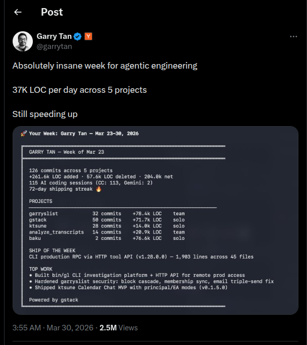
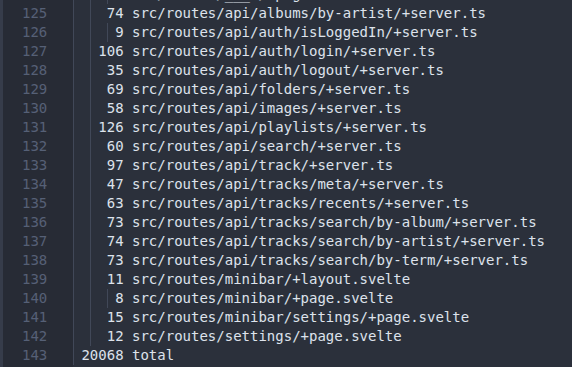

Recently I was successfully rage-baited by a CEO boasting:

_"37K LOC per day across 5 projects...Still speeding up"_

[See here](https://x.com/garrytan/status/2038555792052506941)

I understand the landscape of Agentic Engineering allows us to "move" faster than ever before.

But the question STILL remains... "Where to?"

Even after reading his response to the community backlash [here](https://x.com/garrytan/status/2045404377226285538) and perusing the github of the alleged project, I'm still confused what the Product or Service or App (or Advice?) is being marketed to me.

Regardless, I stand firm in believing that Less (Code) is More.

With less code, (generally):

- Testing becomes easier
- Production issues are quicker to diagnose and resolve
- Design and architecture decisions can be made more clearer
- Build and deployment times are reduced
- Less mental fatigue for developers leading to faster feature delivery

 

The challenging part is **_keeping_** code to a minimum.

During my last sprint, I was able to deliver new features AND increase performance while ending up with LESS code than I originally started with! From 20490 lines to 20068.

About a ~2% code reduction. Not a lot. But...less.

How?

By **_Refactoring_**. Old school style.

Specifically, by leveraging: Design Patterns, DRY Principles, YAGNI, and the like.

The ragebait motivated me to create a script to observe the growth of my own App's main codebase:

`git ls-files --directory src/ | grep -E '\.js|\.ts|\.svelte' | xargs wc -l`

All it does is count the lines per file tracked by git (\*.js, \*.ts, \*.svelte) and also calculates the sum of them all.

I run it after each story I complete to see whether I'm up/down from before.

Its not meant to place a hard limit on lines of code, but instead, to say:

With only 20k lines of code, my app is/has:

- An offline music player
- Themeable
- Crossbrowser
- Responsive to multiple devices
- Custom API support for non-local music management
- Caching enabled
- 2d/3d visualizations

 

And theres still room for improvement, as always!

Til next time, Ciao...

 
 

Some Further Reading:

- Extreme minimalism and obfuscation - [International_Obfuscated_C_Code_Contest](https://en.wikipedia.org/wiki/International_Obfuscated_C_Code_Contest)
